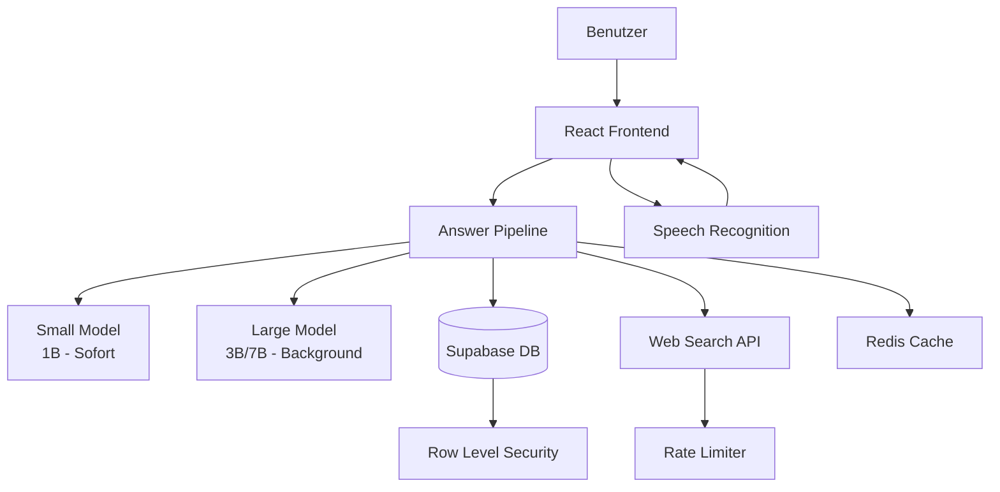

# 🏗️ Technische Architektur: Ländle Chatbot

## Systemübersicht



## 🎨 Frontend-Architektur

### Komponenten-Hierarchie
```
App
├── Header
│   └── ModelStatus (zeigt geladene Modelle)
├── ChatContainer
│   ├── MessageList
│   │   ├── Message
│   │   └── SourceBadge (DB/Web/AI)
│   ├── SuggestionCards
│   └── LoadingIndicator
├── InputContainer
│   ├── TextInput
│   ├── VoiceInput
│   └── SendButton
└── StatusBar
```

### State Management
```typescript
interface AppState {
  messages: Message[]
  isLoading: boolean
  models: {
    small: ModelState
    large: ModelState
  }
  currentInput: string
  voiceActive: boolean
  connectionStatus: 'online' | 'offline'
}

interface ModelState {
  id: string
  loaded: boolean
  loading: boolean
  progress: number
  error?: string
}
```

## 🧠 Answer Pipeline Architektur

### Verarbeitungsfluss
```
1. Anfrage empfangen
   ↓
2. Intent-Erkennung
   ├─→ Lokale Info (DB)
   ├─→ Aktuelle Info (Web)
   └─→ Allgemein (AI)
   ↓
3. Datenquellen abfragen
   ├─→ Cache prüfen
   ├─→ Datenbank
   └─→ Web-Suche
   ↓
4. Kontext aufbereiten
   ↓
5. LLM-Antwort generieren
   ↓
6. Antwort formatieren
   ↓
7. Cache aktualisieren
```

### Intent-Klassifikation
```typescript
enum IntentType {
  LOCATION = 'location',        // Orte, Sehenswürdigkeiten
  RESTAURANT = 'restaurant',    // Essen, Trinken
  EVENT = 'event',             // Veranstaltungen
  HIKING = 'hiking',           // Wandern, Sport
  ACCOMMODATION = 'accommodation', // Hotels, Unterkünfte
  WEATHER = 'weather',         // Wetter
  GENERAL = 'general'          // Allgemeine Fragen
}
```

## 💾 Datenbank-Architektur

### Schema-Design
```sql
-- Basis-Tabellen mit voli_ Präfix
voli_locations
voli_restaurants  
voli_events
voli_hiking_routes
voli_accommodations
voli_faqs
voli_cache

-- Relationen
voli_location_categories
voli_restaurant_cuisines
voli_event_types

-- Metadaten
voli_data_sources
voli_update_logs
```

### Indexing-Strategie
- Full-Text Search auf description, name
- GiST Index für Geo-Koordinaten
- B-Tree für häufige Filterkombinationen

## 🔌 API-Integration

### Google Custom Search
```typescript
interface SearchConfig {
  apiKey: string
  engineId: string
  options: {
    language: 'de'
    region: 'at'
    siteSearch: 'site:vorarlberg.at OR site:vol.at'
    num: 5
  }
}
```

### Supabase Client
```typescript
interface SupabaseConfig {
  url: string
  anonKey: string
  options: {
    auth: { persistSession: true }
    realtime: { enabled: false }
    global: { headers: { 'x-region': 'vorarlberg' } }
  }
}
```

## 🚀 Performance-Optimierung

### Caching-Strategie
1. **In-Memory Cache**: Häufige Anfragen (1h TTL)
2. **Datenbank Cache**: Teure Berechnungen (24h TTL)
3. **Service Worker**: Offline-Funktionalität
4. **CDN**: Statische Assets

### Lazy Loading
- Modelle: Small sofort, Large im Hintergrund
- Komponenten: Code-Splitting für Features
- Daten: Pagination für große Ergebnisse

### Optimierungen
```typescript
// Debouncing für Eingaben
const debouncedSearch = debounce(search, 300)

// Request Batching
const batchRequests = batch(apiCall, 50)

// Memoization für teure Berechnungen
const memoizedIntent = memoize(detectIntent)
```

## 🔒 Sicherheitsarchitektur

### Frontend-Sicherheit
- Content Security Policy
- XSS-Schutz durch React
- Eingabe-Validierung

### API-Sicherheit
- Rate Limiting
- API-Key Rotation
- Request Signing

### Datenbank-Sicherheit
- Row Level Security (RLS)
- Verschlüsselte Verbindungen
- Audit Logging

## 📱 Responsive Design

### Breakpoints
```css
/* Mobile First Approach */
@media (min-width: 640px)  /* Tablet */
@media (min-width: 1024px) /* Desktop */
@media (min-width: 1280px) /* Wide */
```

### Touch-Optimierungen
- Große Touch-Targets (44px minimum)
- Swipe-Gesten für Navigation
- Haptic Feedback

## 🔄 Deployment-Architektur

### Entwicklungsumgebung
```
Local Dev → GitHub → Vercel Preview
```

### Produktionsumgebung
```
GitHub Main → Vercel Production → Cloudflare CDN
```

### Monitoring
- Sentry für Error Tracking
- Vercel Analytics für Performance
- Supabase Dashboard für DB

## 📊 Skalierungskonzepte

### Horizontal Scaling
- Stateless Frontend
- Multiple Worker für Modelle
- Read Replicas für DB

### Vertical Scaling
- Größere Modelle bei Bedarf
- Mehr Cache-Speicher
- Optimierte DB-Queries

---
*Architektur-Version: 1.0 | Stand: Januar 2025*